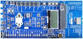
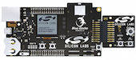

# BGScript

## 開発ボード

| 開発ボード型番 | ボード情報 | 写真 |
| -- | -- |
| BLEDK | [Bluegiga](https://www.bluegiga.com/en-US/products/ble113-bluetooth-smart-module/#devkits) | |
| WSTK6101A | [SiliconLabs](http://www.silabs.com/products/wireless/bluetooth/Pages/bluegecko-bluetooth-smart-module-wireless-starter-kit.aspx) ||

## 開発ツール

* [Bluetooth Smart Software and SDK v.1.3.2](https://www.bluegiga.com/en-US/download/?file=TK48JyZjQHujdh-E_060nA&title=Bluetooth%2520Smart%2520Software%2520and%2520SDK%2520v.1.3.2&filename=ble-1.3.2-122.zip)

## 転送ツール

* [BLE Update Tool v1.3.6 (Windows XP,7,8 and 10)](https://www.bluegiga.com/en-US/download/?file=QQoshv77RRWK1AiJw8cV5g&title=BLE%2520Update%2520Tool%2520v1.3.6%2520%28Windows%2520XP%252C7%252C8%2520and%252010%29&filename=bleupdate-1.3.6.exe)

## デバッカー

* [CC-DEBUGGER](http://www.tij.co.jp/tool/jp/cc-debugger)

## バッテリー評価

* [Bluegiga Bluetooth Smart Module Battery Estimator](https://www.bluegiga.com/en-US/test-page/ble-battery-estimator/)

## 開発言語
* BGScript

##Chip一覧

| Chip名 | 送信感度 | 0dBm時 送信時電流 | 受信感度 | 受信時電流 |
| -- | -- | --- |
| [BGM111](http://www.silabs.com/products/wireless/bluetooth/Pages/bluegecko-bluetooth-smart-module-intro.aspx) |+8 dBm | 8.2 mA |  -93dBm |7.5 mA |
| [CC2541](http://m.tij.co.jp/product/jp/CC2541) | +6dBm | 18.2 mA 14.7mA(DD)| -96dBm| 17.9 mA  14.7mA(DD)| 
| [CC2540](http://m.tij.co.jp/product/jp/CC2540)| +6dBm | 24mA 15.8 mA(DD)  | -96dBm| 19.6 mA 18.6 mA(DD) |

