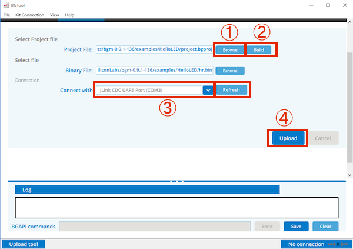

# BGScript入門

## HelloLED

| ファイル名 | 概要　 |
| -- | -- |
| hardware.xml | ハードウェア構成を定義 |
| GATT.xml | GATTサービスを定義 |
| bgscript.bgs | BGSCript本体 |
| hr_project.bgproj | プロジェクトを定義


hardware.xml
```
<?xml version="1.0" encoding="UTF-8" ?>

<hardware>
</hardware>
```

GATT.xml
```
<?xml version="1.0" encoding="UTF-8"?>

<gatt>
</gatt>
```

bgscript.bgs for BGM111
```
event system_boot(major, minor, patch, build, ll_version, protocol_version, hw)
    // Init
    call hardware_configure_gpio(5,6,hardware_gpio_mode_push_pull,1)
    // LED On $40(0100 0000->6pin)
    call hardware_write_gpio(5,$40,$00)
end
```

bgscript.bgs for BLE1XX
```
event system_boot(major, minor, patch, build, ll_version, protocol_version, hw)
    # 0000 0011 $03 P0_0,P0_1をenableに
    call hardware_io_port_config_direction($0,$03)
    
    # 0000 0011 $03 をHIGHに
    call hardware_io_port_write($0,$03,$03)
end
```

project.bgproj for bgm111
```
<?xml version="1.0" encoding="UTF-8" ?>

<!-- Project file for BGM111 Bluetooth Smart module -->
<project device="bgm111">

	<!-- GATTサービスデータベース -->
	<gatt in="GATT.xml" />
	
	<!-- ハードウェアの設定 -->
    <hardware in="hardware.xml" />
    
	<!-- BGScript本体 -->
	<scripting>
		<script in="bgscript.bgs" />
    </scripting>
	
	<!-- Firmware output file -->
	<image out="hr.bin" />
   
</project>
```


hardware_io_port_writeでは、($0,$03,$03)の記述で、
P0_0, P0_1 $03 (0000 0011)に関して、$03(000 0011)の値を送っている。


## 実機への転送

BGToolで実機へ転送する

