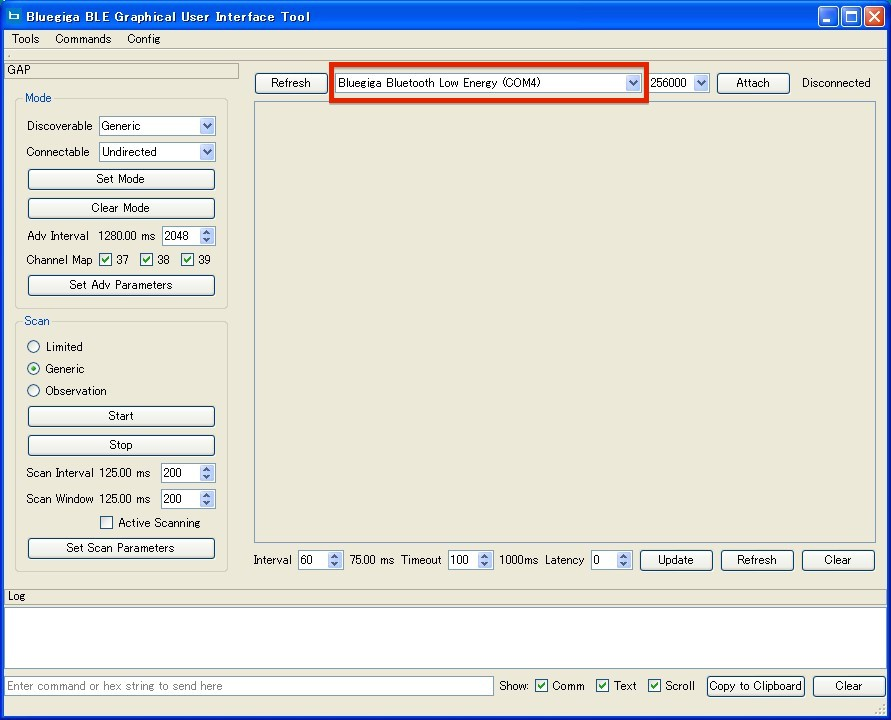
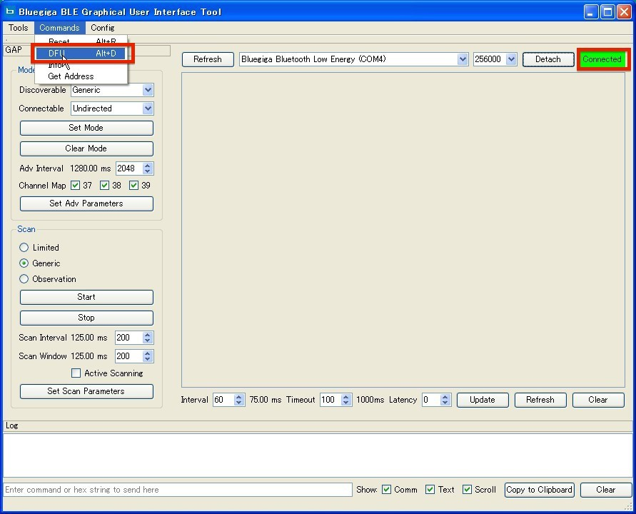
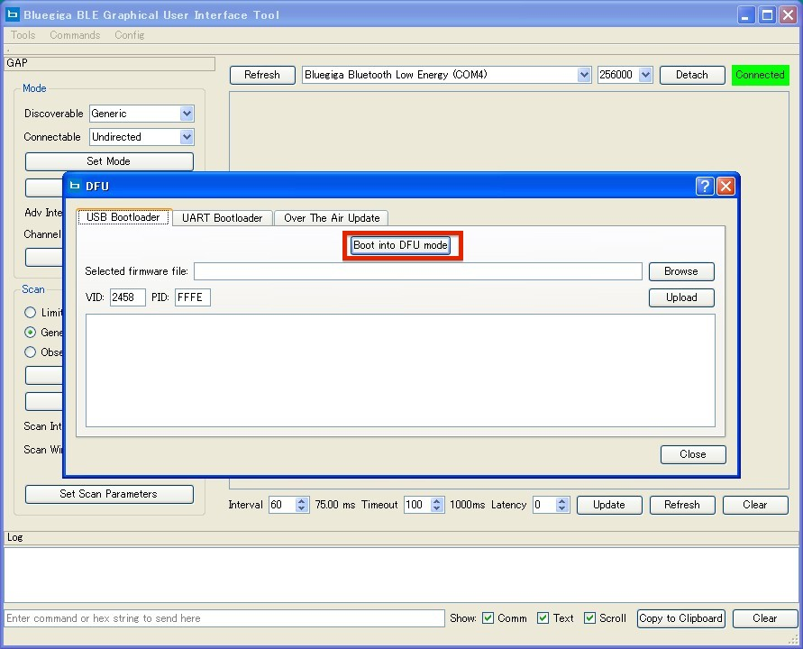
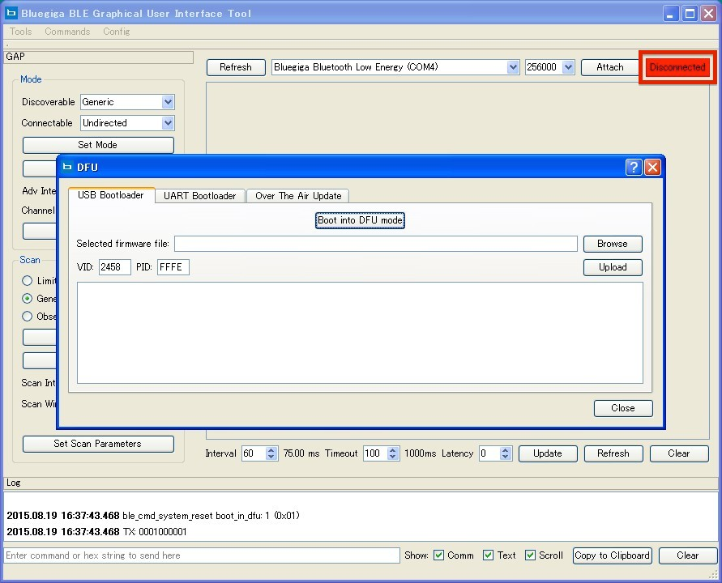
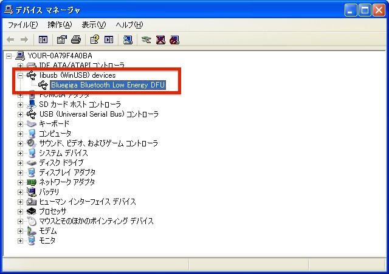
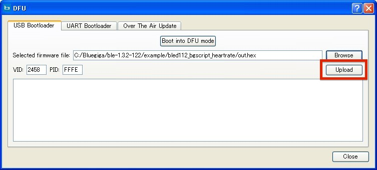
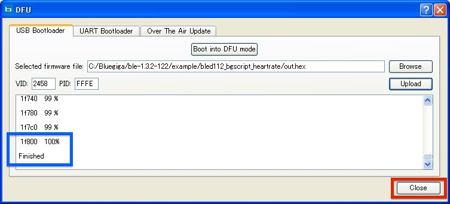

#BLED１１２の焼き込み

BLED112の焼き込みは、CCDebuggerを使用せず、直接WindowsのPCに接続して行います。


## 環境設定

「Bluetooth Smart Software and SDK」の最新バージョンをダウンロードする。
<br>
(記入時点の最新版はv.1.3.2）
<br>
https://www.bluegiga.com/en-US/products/bled112-bluetooth-smart-dongle/


## DFUモード起動

<br>
ダウンロードしたファイルを展開する。
<br>
展開したファイルのbinフォルダ内に格納されている「blegui2.exe」を実行し、BLE GUI toolを起動する。
<br>
BLED112をUSBポートに接続し、BLE GUI ToolにてBLED112が接続されているポートを選択する。
<br>


「Attach」ボタン押下でBLED112と接続後、メニューの「Commands」より「DFU」を選択する。
<br>


DFUのウィンドウにて、初期状態で選択されている「USB Bootloader」タブを選択し、「Boot Into DFU mode」ボタンを押下する。
<br>

<br>
※ここでドライバが必要になる場合、ダウンロードしたファイルから「windrv」フォルダ内にある「dfu.ini」を指定してインストールする。

DFUモードにて接続が完了すると、画面上の「Connected」から「Disconnected」に変更される。


デバイスマネージャにて下の図のようになっていることを確認する。
<br>


## 焼き込みデータの作成

作成したファイルに以下の内容を追記する


### 1.焼き込みに必要な条件


bgprojファイル
```
<config in="config.xml" />
```

hardware.xml
```
<script enable="true" />
```


config.xml
```
<?xml version="1.0" encoding="UTF-8" ?>
<config>
    <script force="true" />
</config>
```
<br>
### 2.DFUモードに移行する条件

DFUモード(焼き込みを行うためのモード)に移行するには、bgsファイルへ下記のコードを追加する必要がある。
```
call system_reset(1)
```
この箇所が呼び出されるとDFUモードに移行するため、特定の条件の時に呼び出されるように記述すること。

**※DFUモードに遷移する条件を追加しておかないと再度焼き込みを行うことが出来なくなってしまうので注意！
**

下の例では外部端末からのアクセスで簡単にDFUモードに遷移できてしまうので、この例はテスト用として使用すること

【例】
<br>
gatta.xml
```
    <!-- custom service for allowing DFU-mode reboots -->
    <service uuid="4f3edfe7-6f17-4f87-b2ee-ea2cdac0dd02">
        <description>DFU Reboot Service</description>
        
        <!-- custom characteristic for allowing DFU-mode reboots -->
        <characteristic uuid="590c4bd9-b5e2-4a1a-867e-9b033ed1eadb" id="c_dfu_reboot_trigger">
            <description>DFU Reboot Trigger</description>
            <properties write="true" />
            <value length="1" />
        </characteristic>
        
    </service>
```
<br>
bgsファイル
```
event attributes_value(connection, reason, handle, offset, value_len, value_data)
    if handle = c_dfu_reboot_trigger then
        call system_reset(1)
    end if
end
```


## Hexファイルの作成

コマンドプロンプトを起動し、bgprojファイルがある場所に移動する。
<br>
移動後、下記のコマンドを実行し、Hexファイルを作成する。
<br>
(bgbuild.exeの場所やbgprojの格納場所によって変更する)
```
c:¥bluegiga¥ble-1.3.2-122/bin\bgbuild.exe project.bgproj
```

##焼き込み
Selected Firmware fileの項目にてhexファイルを選択し、Uploadボタンを押下する
<br>


logに「Finish」が表示されたら完了
<br>


## DFUモード移行（再焼き込み）
例で記載したコードで焼き込みを行った場合の処理になります。

1．BLED112をwindowsのPCに接続する。

2．BLE対応の外部端末より、BLED112にてBluetooth接続する。

3．uuid：4f3edfe7-6f17-4f87-b2ee-ea2cdac0dd02を選択する。

4．キャラクタリスティックuuid：590c4bd9-b5e2-4a1a-867e-9b033ed1eadbを選択。

5．「0x00」などの値を書込み、DFUモードに移行することを確認する。

6．blegui2.exeよりBLE GUI Toolを起動し、メニューよりDFUを選択する。

7．焼き込み対象のHexファイルを指定し、Uploadボタンを押下する。

これで再焼き込み完了です。