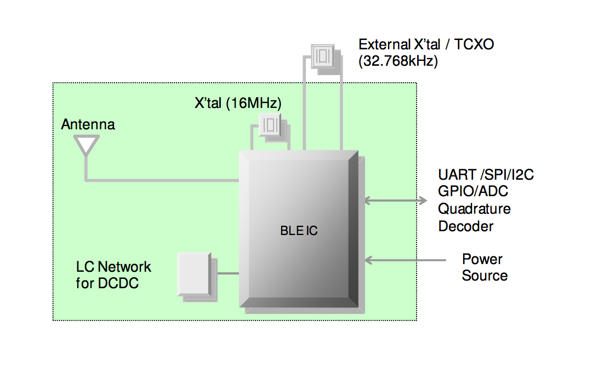
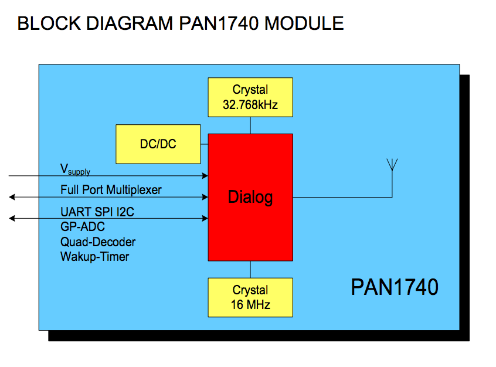
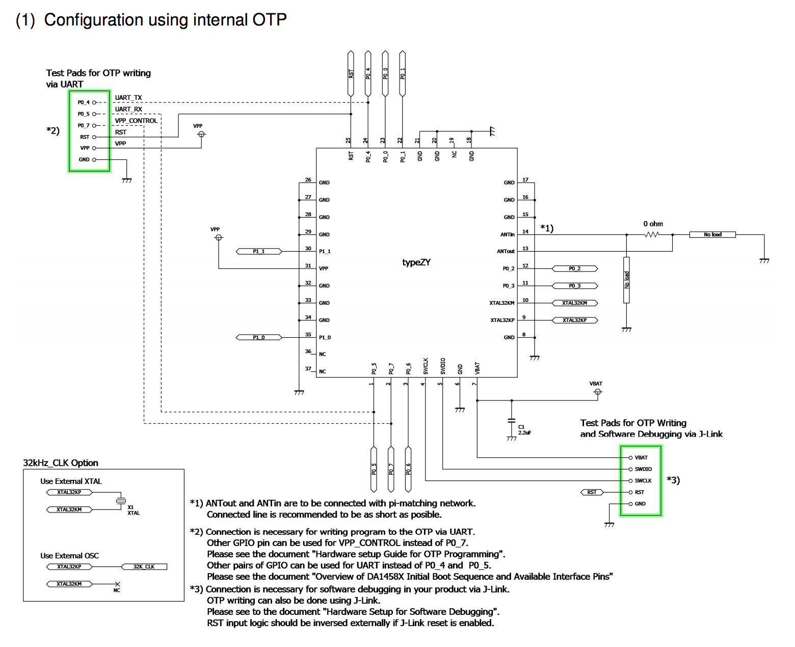
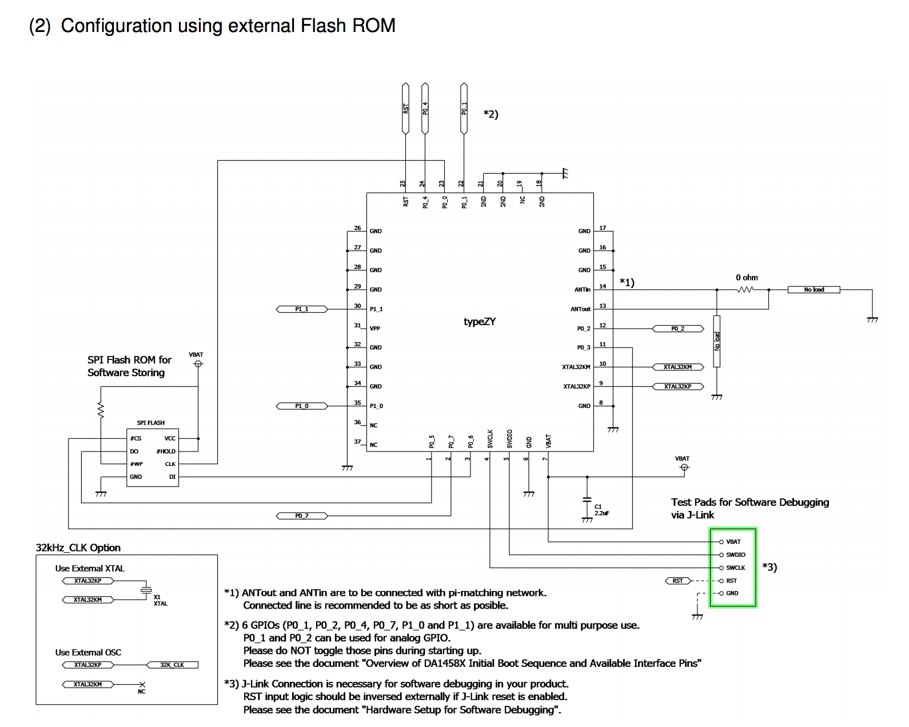
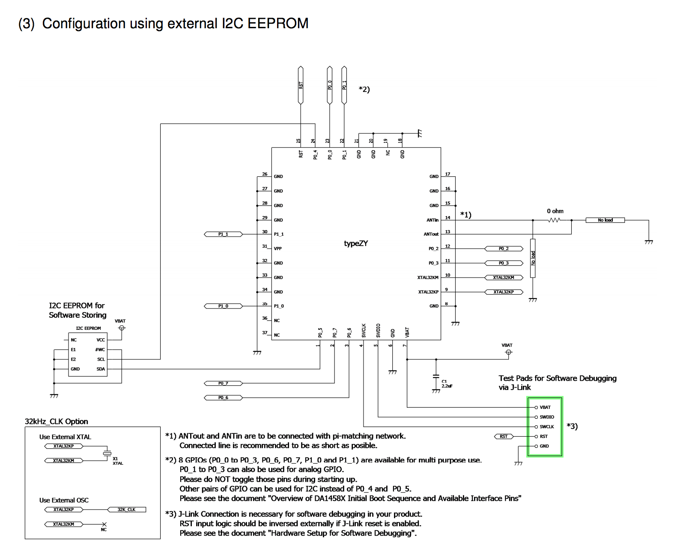

# Dialog系BLEモジュール

## Co-processor
ARM® Cortex™ M0

## 開発者サイト
http://support.dialog-semiconductor.com/

## 開発に必要なハードウェア
### DA14580DEVKT-B
Dialog’s DA14580 Bluetooth® Smart Development Kit - Basic


http://dialog-semiconductor.com/products/bluetooth-smart/smartbond-development-tools/bluetooth-smart-development-kit

| 開発キット | 購入先 | 価格|
| -- | -- | -- |
| [DA14580DEVKT-B](http://www.futureelectronics.com/en/technologies/development-tools/rf-wireless/Pages/2046391-DA14580DEVKT-B.aspx?IM=0) | Future Electronics | $99 |
| [DA14580DEVKT-B](http://www.digikey.jp/product-detail/ja/DA14580DEVKT-B/1564-1000-ND/5113983) | Digi-key|13,320円|

## 開発に必要なソフトウェア

| ツール | 提供元 |
| -- | -- |
| [Keil MDK-ARM Version 5](https://www.keil.com/download/product/) | Keil |
| [the Jlink software & documentation pack for Windows](https://www.segger.com/jlink-software.html)|segger|

## 開発に必要なドキュメント

[DA14580DEVKT-BUserGuide](http://www.cdiweb.com/datasheets/iwatt/DA14580DEVKT-BUserGuide.pdf) 


## DA14580搭載モジュール
| モジュール名 | BLE Chip　| Ver | メーカー | 技適 | 最大送信出力|受信感度|TX最大電流|スリープモード|
| -- | -- | -- |-- |-- |
| [Type ZY](http://www.murata.co.jp/products/microwave/module/bluetoothmodule/schematic/typez.html#tab) | DA14580 | 4.1 | [Murata](http://www.murata.co.jp/) | [済](http://www.tele.soumu.go.jp/giteki/SearchServlet?pageID=jg01_01&PC=001&TC=G&PK=1&FN=387tele&SN=%8F%D8%96%BE&LN=32&R1=*****&R2=*****) |0dBm||4.8mA|0.6uA|
|[PAN1740](http://eu.industrial.panasonic.com/products/wireless-connectivity/bluetooth/bluetooth-smart-low-energy/series/pan1740/CS464/model/ENW89846A1KF) | DA14580 | 4.1 | [Panasonic](http://eu.industrial.panasonic.com/)|未|0dBm|-93dBm|4.9mA|<1uA|
### TypeTZ  Block diagram



### PAN1740 Block diagram



### TypeTZメモリなしでのOTA対応
> 
[Bluetooth Low Energy Module Data Sheet](http://wireless.murata.com/RFM/data/lbca2hnzyz-711.pdf) P15

### TypeTZ SPI FlashメモリでのOTA対応
>
[Bluetooth Low Energy Module Data Sheet](http://wireless.murata.com/RFM/data/lbca2hnzyz-711.pdf) P16

### TypeTZ I2C EEPROMでのOTA対応
>
[Bluetooth Low Energy Module Data Sheet](http://wireless.murata.com/RFM/data/lbca2hnzyz-711.pdf) P17

# 参考になる情報
* [PAN1740設計ガイド](http://www.mouser.jp/pdfdocs/PAN1740DesignGuideRev101.PDF)(Panasonic)
* [Bluetooth Low Energy Module Data Sheet ](http://wireless.murata.com/RFM/data/lbca2hnzyz-711.pdf)(Murata)

# SampleCode
Serialで出力 

```c
#include <stdio.h>
#include "global_io.h"
#include "peripherals.h"
#include "uart.h"

int main (void)
{
    periph_init();
    printf_string("Hello Dialog\n\r");
}
```

P0_0ピンをHigh(3V)

```c
#include <stdio.h>
#include "global_io.h"
#include "gpio.h"
#include "peripherals.h"
#include "uart.h"

int main (void)
{
    periph_init();
    printf_string("TEST1\n\r");
	
    GPIO_SetActive(GPIO_PORT_0, GPIO_PIN_0);
    GPIO_ConfigurePinPower(GPIO_PORT_0, GPIO_PIN_0, GPIO_POWER_RAIL_3V);
}
```

P0_0ピンを点滅
```c
#include <stdio.h>
#include "global_io.h"
#include "gpio.h"
#include "peripherals.h"
#include "uart.h"


int main (void)
{
    periph_init();
    printf_string("TEST1\n\r");
    
    GPIO_SetActive(GPIO_PORT_0, GPIO_PIN_0);
	GPIO_ConfigurePinPower(GPIO_PORT_0, GPIO_PIN_0, GPIO_POWER_RAIL_1V);

	int i = 0;
	while(1){		
		if ( i == 1000000) {
			GPIO_ConfigurePinPower(GPIO_PORT_0, GPIO_PIN_0, GPIO_POWER_RAIL_3V);
		} else if ( i > 2000000){
			GPIO_ConfigurePinPower(GPIO_PORT_0, GPIO_PIN_0, GPIO_POWER_RAIL_1V);
			i = 0;
		}
		i++;
	}
}
```


