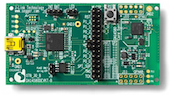
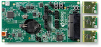

# DA1458x, DA1458x開発環境

## 開発ボード

| 開発ボード型番 | ボード情報 | 写真 |
| -- | -- |
| Basic |  | |
| Pro |  | |

## 開発IDE

[MDK-ARM Microcontroller Development Kit](http://www.keil.com/arm/mdk.asp)

## 転送アプリ

Smart Snippets

## 対応デバッカー

* J-LINK
* U-LINK

## RTOS

[RivieraWaves Kernel](http://www.ceva-dsp.com/RivieraWaves-Bluetooth-Platforms) ([CEVA](http://www.ceva-dsp.com/))

## 開発言語
C/C++

## Chip一覧

| Chip名 | 送信感度 | 0dBm時 送信時電流 | 受信感度 | 受信時電流 |
| -- | -- | --- |
|[DA14680](http://www.dialog-semiconductor.com/docs/site-pdf/dialog-smartbond-da14680-product-brief-japanese.pdf?sfvrsn=2)| 0dBm |4.2mA | -93dBm | 4.3mA | 
| [DA14580](http://www.dialog-semiconductor.com/products/bluetooth-smart) | 0dBm | 3.4mA(DD*) | -93dBm| 3.7mA(DD*) |

## Module一覧

| モジュール名 | BLE Chip　| Ver | メーカー | 技適 | 最大送信出力|0dBm時 送信時電流|
| -- | -- | -- |-- |-- |
| [Type ZY](http://www.murata.co.jp/products/microwave/module/bluetoothmodule/schematic/typez.html#tab) | DA14580 | 4.1 | [Murata](http://www.murata.co.jp/) | [済](http://www.tele.soumu.go.jp/giteki/SearchServlet?pageID=jg01_01&PC=001&TC=G&PK=1&FN=387tele&SN=%8F%D8%96%BE&LN=32&R1=*****&R2=*****) |0dBm|4.8mA|
|[PAN1740](http://eu.industrial.panasonic.com/products/wireless-connectivity/bluetooth/bluetooth-smart-low-energy/series/pan1740/CS464/model/ENW89846A1KF) | DA14580 | 4.1 | [Panasonic](http://eu.industrial.panasonic.com/)|未|0dBm|4.9mA|
|[SESUB](http://www.avnet-abacus.eu/fileadmin/user_upload/Products_Menu/TDK/SESUB-PAN-D14580_Product_Preview_RevG_20150305.pdf) | DA14580 | 4.1 | [TDK](http://www.tdk.co.jp/) | 未 | 0dBm | 5.0mA|

