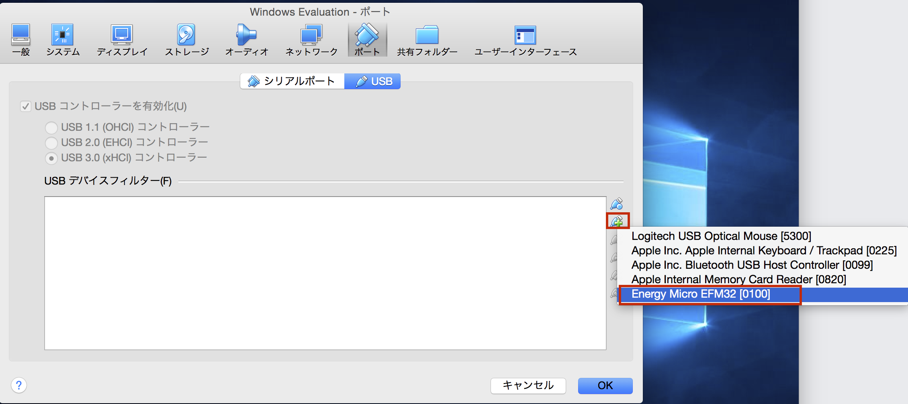
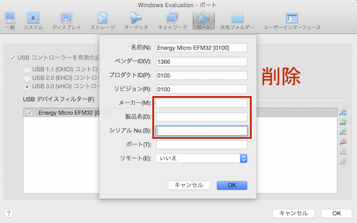
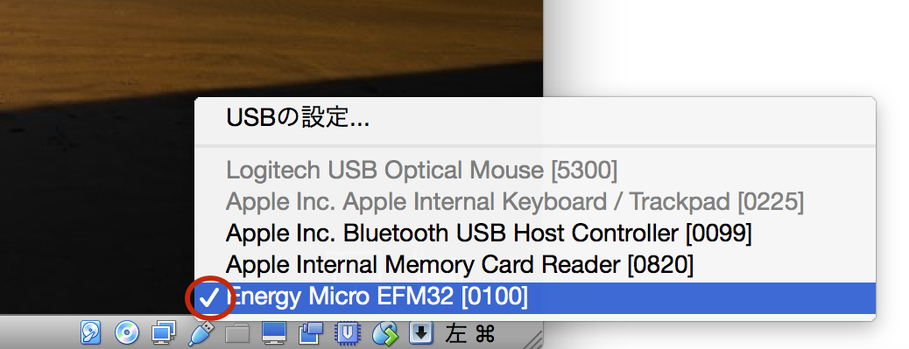

# BlueGeckoの開発環境の構築

## BGToolをダウンロード

* ダウンロード先
http://www.silabs.com/Support%20Documents/RegisteredDocs/blue-gecko-software.exe

## 実行ファイル

| フォルダ名 | ツール |
| -- | -- |
| C:\SiliconLabs\bgm-0.*.*-***\bin\bgbuild.exe | BGScriptのBuildツール |
| C:\SiliconLabs\bgm-0.*.*-***\bin\bgtool.exe | Test/焼き込みツール |

## WSTK6101AをVirtualBoxに認識させる

WSTK6101AをVirualBoxに認識させるには、[USBの設定...]を洗濯し、USBデバイスフィルターに、"Energy Micro EFM32 [0100]"を追加する。追加したのち、追加アイコンの下のオレンジ色のアイコンで、パレメーターから、メーカー名、製品名、シリアルNoを削除する。

VirtualBoxを再起動して、BlueGeckoをUSBポートに差し込むことで、認識するようになる。

"Energy Micro EFM32 [0100]"の前にチェックマークがはいっていると認識済みになる。

