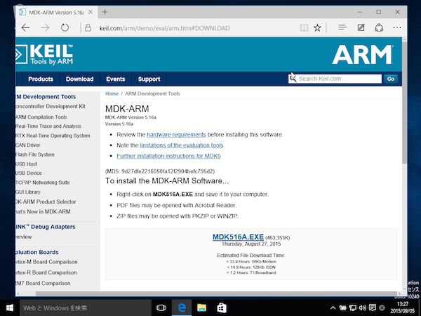

# Keil MDK-ARM

## 現在のバージョン

* 5.16a

## MDK-ARM価格一覧

| ライセンス | 価格 | 詳細 |
| -- | -- | -- |
| MDK-Professional | 30-40万円(1年ライセンス) | Middleware Librariesも付属 |
| MDK-Standard | 約25-30万円(1年ライセンス)| Cortex®-Mシリーズ, ARM7,ARM9,Cortex®-R, SecureCore　|
| MDK-Cortex-M | 約20万円(1年ライセンス）| Cortex®-Mシリーズ限定 |
| MDK-Lite | 無料| 32K制限 |

## Keil MDK-ARMがサポートしているモジュール

* [DA14580](http://www.keil.com/dd/chip/6853.htm)
* [CYBL10X6X](http://www.keil.com/dd/chips/cypress/arm.htm)
* [nrf51822](http://www.keil.com/dd/chips/nordic/arm.htm)

## Keil MDK-ARMの評価版のインストール

[https://www.keil.com/demo/eval/arm.htm](https://www.keil.com/demo/eval/arm.htm) より評価版をダウンロードし、インストールする。

## Copy And Pasteを有効にする

VirtualBoxのメニューから[デバイス]-[Guest Additions CDイメージの挿入]を選択し、インストールする。

