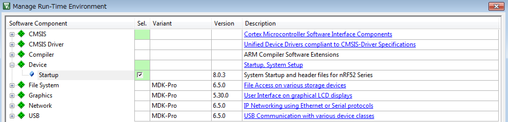
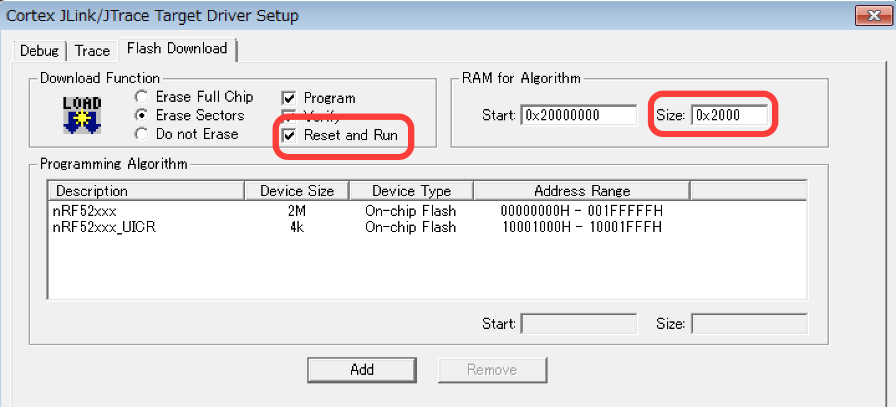
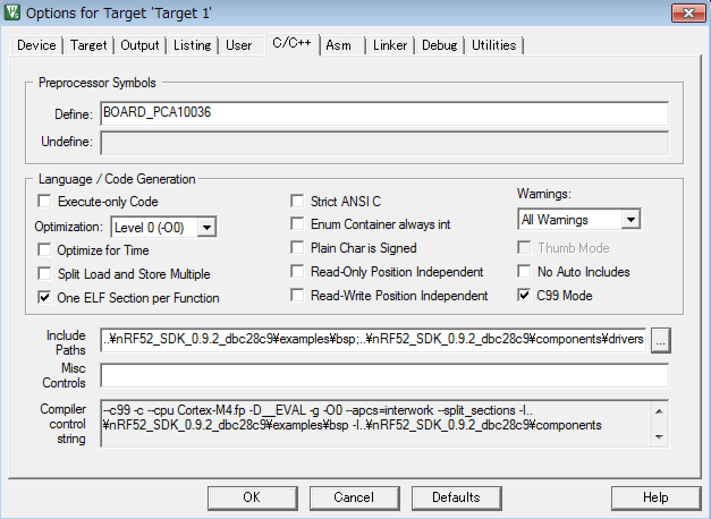

# 開発環境(nRF52)

# nRF52を使ったプログラムの作成方法 

## 使用した環境
* MDK-Lite Ver. 5.16a
* Windows 7
* nRF52 Development Kit (PCA10040)

## 手順

手順はほぼnRF51と同じなので、詳細は[コチラ](https://www.gitbook.com/book/fabo/bledocs/edit#/edit/master/nordic/dev802.md)を参照。  
現状(2015/12)ではまだPreviewなので提供されているPackは最小限な模様。


### 空のApplication作成

1. Keil uVision5を起動する

2. uVision5のProjectメニューから新たにプロジェクトを作成する

3. Deviceの設定を聞かれるのでSofware PacksのnRF52832_xxAAを選択する
  

4. Pack選択でDeviceのStartupを選択し、Bootに必要なプログラムをインストールする  
  

5. 設定を変更する  

 5.1. Options for Targetを選択する  
    
 5.2. DebugタブのUseを"J-LINK / J-TRACE Cortex"に変更する  
  
 5.3. PortをSWに変更する
  
 5.4. JLinkの設定を変更する
  * "Reset and Run"をチェックし、書き込み時にリセット＆実行を行う。また、Sizeの値も変更する。
  

5. Applicationを作成する  
 5.1. Project内のグループ名(今回はApplication)を右クリックし、"Add New Item to.."を選択する
  
 5.2. main.cを作成する
  
 5.3. 今回は無機能のApplicationなので、空のmain文のみにする

  ```int main() {  
  }
  ```

6. ビルドして実機にダウンロードする  
 6.1. ビルドボタンをクリックするとビルドされます  
 
 
 6.2. LOADボタンを押すとプログラムの書き込みが開始されます（プログラムが空なので何も起こりません）  
 


### LED点灯Application作成

まだ提供されているPackが少ないようなので、Pack無しでLED点滅プログラムの作成方法を説明します。  
Packが無いものは自分でヘッダをインクルードしたり、SDKからソースをコピーする必要が出てきます。

1. 設定を変更する  

 1.1. Options for Targetを選択する  
    
 1.2. C/C++を選択し、下記の設定を行う。
  *  DefineにBOARD_PCA10036を設定
  *  C99Modeにチェック
  *  IncludePathsに"\[nRF52_SDK]\examples\bsp"と"\[nRF52_SDK]\components\drivers_nrf\hal"を追加する。（[nRF52_SDK]はSDKへのパス）
  

2. プログラムを変更する  

  ```
 #include "boards.h"   
 int main() {
    LEDS_CONFIGURE(LEDS_MASK);
    LEDS_OFF(LEDS_MASK);
    LEDS_INVERT(BSP_LED_0_MASK);
 }
  ```

3. ビルドして実機にダウンロードする  
 3.1. ビルドボタンをクリックするとビルドされます  
 
 
 3.2. LOADボタンを押すとプログラムの書き込みが開始されます（LED_0が点灯します）  
 
