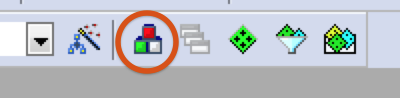
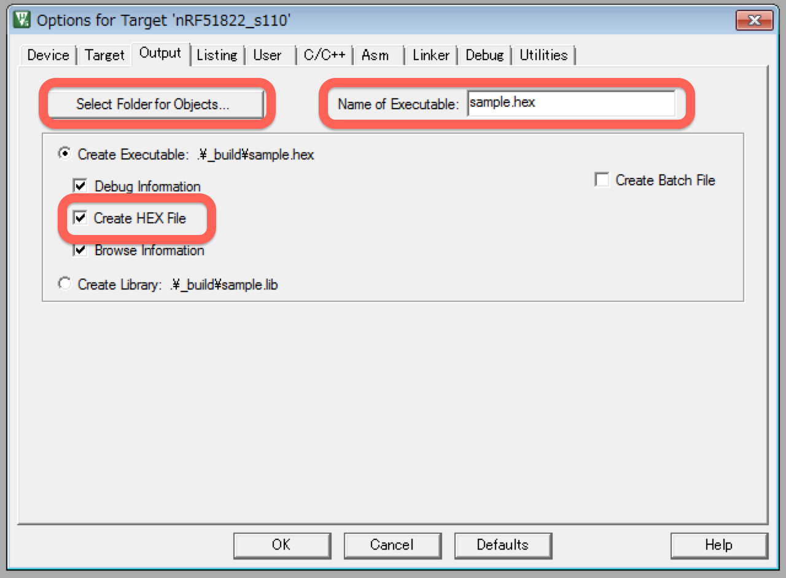

# 開発環境(nRF52)

# nRF52使ったプログラムの作成方法 

## 使用した環境
* MDK-Lite Ver. 5.16a
* Windows 7
* nRF52 Development Kit (PCA10040)

## 手順

### Application作成


1. Application用のTargetを作成  

 1.1. ManageProjectItemsを選択する  
    

 1.2. 新しいTargetを作成する  
      今回は"nRF51822_s110"とする
  

 1.3. 新しいターゲットを選択する  
  

2. hexファイルをビルドターゲットから外す  

 2.1. nRF_SoftDeviceを右クリックし、"Options for Component..."を選択する  
    

 2.2. "Include in target build"のチェックを外す
  

3. 設定を変更する  

 3.1. Options for Targetを選択する  
    

 3.2. Targetタブの設定を変更する  
  * Xtal:16.0
  * Use MicroLIB: ON
  * IROM1 Start: 0x18000
  * IROM1 Size: 0x28000
  * IRAM1 Start: 0x20002000
  * IRAM1 Size: 0x6000
   
  Xtalは発振器の速度、MicroLIBは最適化オプション、MemoryAreaはメモリマップを参考にROMにはAPP_CODE_BASE、RAMにはAPP_RAM_BASEを入力する  
    

 3.3. Outputタブの設定を変更する   
    * "Select Folder for Objects.."で出力フォルダを選択する  
    * ここでは"_build"とする  
    * "Name of Executable"に出力hex名を入力する  
    * "Create HEX File"をチェックする  
   

 3.4. Listingタブの設定を変更する 
    * "Select Folder for Listings.."でOutputで設定したフォルダを選択する
   
   
 3.5. Linkerタブの設定を変更する
    * "Use Memory Layout from Target Dialog"をチェックし、メモリマップをTargetタブでの設定と同じくする
   

 3.6. JLinkの設定を変更する
    * "Reset and Run"をチェックし、書き込み時にリセット＆実行を行う
   
 
4. 必要なPackをインストールする  
 4.1. Manage Run-Time Environmentを選択する  
    
 4.2. DeviceのStartupを選択し、Bootに必要なプログラムをインストールする  
  

5. Applicationを作成する  
 5.1. Project内のグループ名(今回はApplication)を右クリックし、"Add New Item to.."を選択する
  
 5.2. main.cを作成する
  
 5.3. 今回は無機能のApplicationなので、空のmain文のみにする

  ```int main() {  
  }
  ```

6. ビルドして実機にダウンロードする  
 6.1. ビルドボタンをクリックするとビルドされます  
 
 
 6.2. LOADボタンを押すとSoftDeviceの書き込みが開始されます  
 

