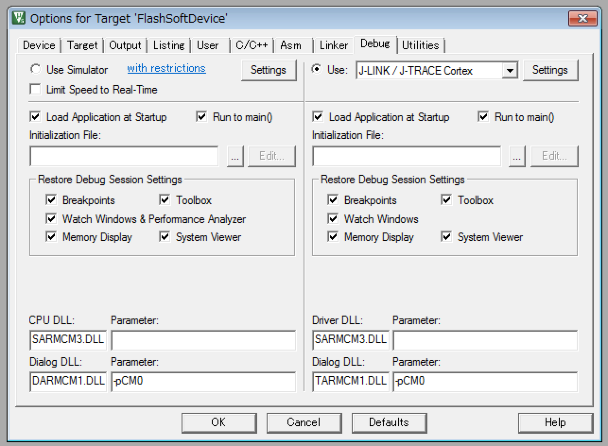

# 開発環境(nRF52)

# nRF52使ったプログラムの作成方法 

## 使用した環境
* MDK-Lite Ver. 5.16a
* Windows 7
* nRF52 Development Kit (PCA10040)

## 手順

手順はほぼnRF51と同じなので、詳細は[コチラ](https://www.gitbook.com/book/fabo/bledocs/edit#/edit/master/nordic/dev802.md)を参照。
現状(2015/12)ではまだPreviewなのでPackは用意されていない模様。
なので、ソースを自分でプロジェクトにコピーする必要がある。


### Application作成

1. Keil uVision5を起動する

2. uVision5のProjectメニューから新たにプロジェクトを作成する

3. Deviceの設定を聞かれるのでSofware PacksのnRF52832_xxAAを選択する
  

4. Pack選択でDeviceのStartupを選択し、Bootに必要なプログラムをインストールする  
  

5. 設定を変更する  

 5.1. Options for Targetを選択する  
    
 5.2. DebugタブのUseを"J-LINK / J-TRACE Cortex"に変更する  
  
 5.3. PortをSWに変更する
  
 5.4. JLinkの設定を変更する
    * "Reset and Run"をチェックし、書き込み時にリセット＆実行を行う
   
 

5. Applicationを作成する  
 5.1. Project内のグループ名(今回はApplication)を右クリックし、"Add New Item to.."を選択する
  
 5.2. main.cを作成する
  
 5.3. 今回は無機能のApplicationなので、空のmain文のみにする

  ```int main() {  
  }
  ```

6. ビルドして実機にダウンロードする  
 6.1. ビルドボタンをクリックするとビルドされます  
 
 
 6.2. LOADボタンを押すとSoftDeviceの書き込みが開始されます  
 

