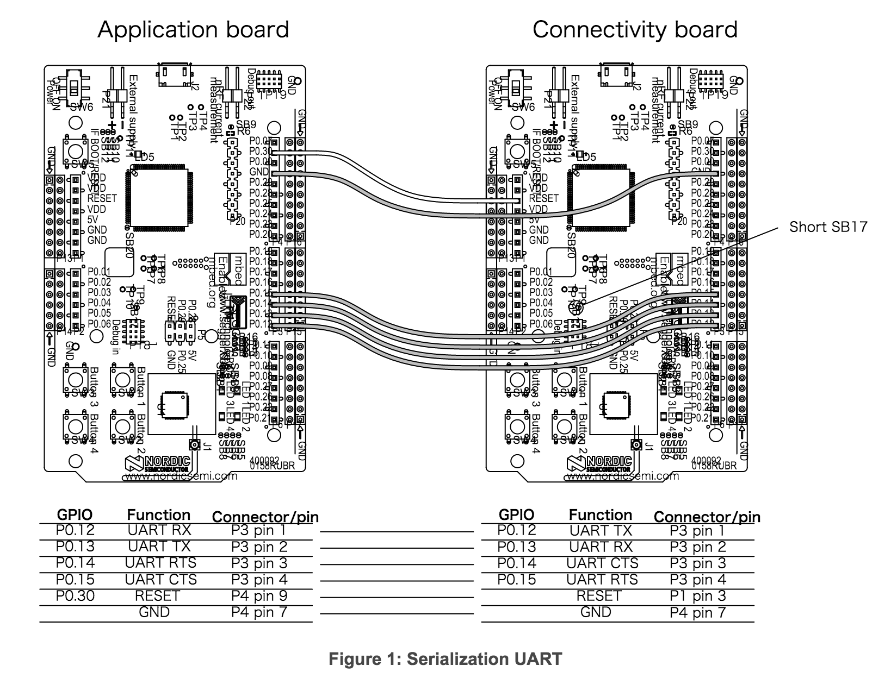

# Serialization

## 概要

nRF51に直接実装せずに外部MCUなどからシリアル通信で制御する方式をBLE serializationと呼ぶ。

* [ドキュメント](http://infocenter.nordicsemi.com/index.jsp?topic=%2Fcom.nordic.infocenter.sdk51.v10.0.0%2Flib_serialization.html)

ドキュメントで紹介されている方法は開発ボードを二台接続して、ApplicationBoard（制御する側）とConnectivityBoard（制御される側）に分けて実装を行う方法になる。  
実際はApplicationBoard側はnRF51を使用せずにARMを直で使用することが多くなるはず。  
接続はUART, SPI, HCIが利用できる。

ApplicationBoardではSoftdeviceを使用しないが専用ライブラリによりSoftdeviceを使用した時と同じコードでConnectivityBoardを制御することができる。  
ConnectivityBoardには、Softdeviceと接続用のアプリケーションをインストールする。  
接続アプリは利用するSoftdevice毎に下記フォルダーに用意されている。

* [SDK]/examples/ble_central_and_peripheral/ble_connectivity [S130]
* [SDK]/examples/ble_peripheral/ble_connectivity [S110]
* [SDK]/examples/ble_central/ble_connectivity [S120]

## Arduinoとつなぐ

ArduinoをApplicationBoardとしてつなぐ場合は専用ライブラリが利用できないので、直にシリアル通信を行う必要がある。  
また、Arduinoはフローコントロールができないなど、シリアル通信の設定も変える必要もある。

### 接続アプリのコンパイル

接続アプリはコード量が多いのでKeilの無料版でばビルドできないので、今回はGCCを用います。  
[こちら](https://launchpad.net/gcc-arm-embedded)からArm用のGCCをダウンロードし、任意の場所へ置く。

[SDK]/components/toolchain/gcc/Makefile.posix  

のGNU_INSTALL_ROOTにGCCの場所を記載。

