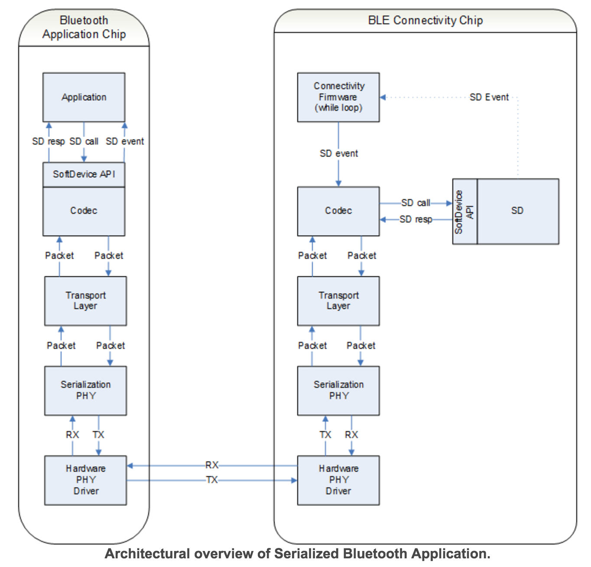

# Serialization

nRF51に直接実装せずに外部MCUなどからシリアル通信で制御する方式をBLE serializationと呼ぶ。

* [ドキュメント](http://infocenter.nordicsemi.com/index.jsp?topic=%2Fcom.nordic.infocenter.sdk51.v10.0.0%2Flib_serialization.html)

ドキュメントで紹介されている方法は開発ボードを二台接続して、ApplicationBoard（制御する側）とConnectivityBoard（制御される側）に分けて実装を行う方法になる。
実際はApplicationBoard側はnRF51を使用せずにARMを直で使用することが多くなるはず。
接続はUART, SPI, HCIが利用できる。

ApplicationBoardではSoftdeviceを使用しないが専用ライブラリによりSoftdeviceを使用した時と同じコードでConnectivityBoardを制御することができる。
ConnectivityBoardには、Softdeviceと接続用のアプリケーションをインストールする。
接続アプリは利用するSoftdevice毎に下記フォルダーに用意されている。

* \examples\ble_central_and_peripheral\ble_connectivity for SoftDevice S130
* \examples\ble_peripheral\ble_connectivity for SoftDevice S110
* \examples\ble_central\ble_connectivity for SoftDevice S120

