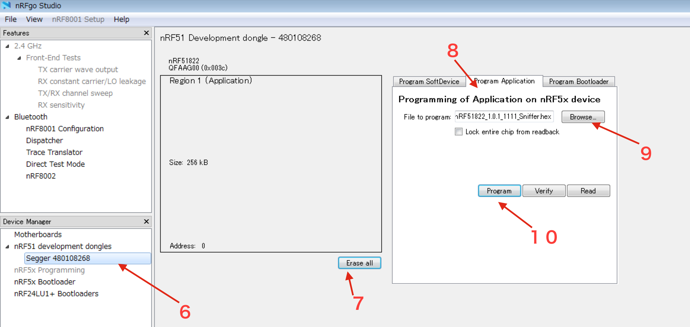
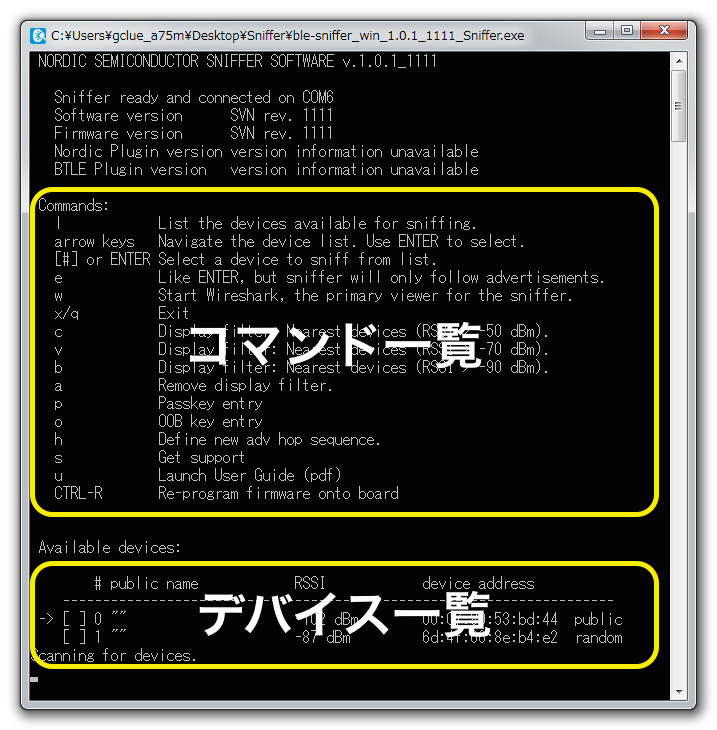
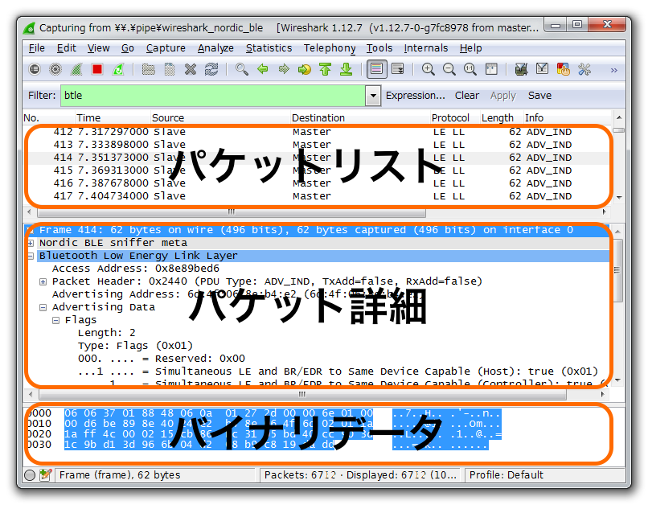

# パケットスニファの設定

## 必要なハード

* PCA10000
* PCA10031

## 必要なソフト

* Windows7以降 
* [nRFgo Studio](https://www.nordicsemi.com/eng/nordic/download_resource/47572/62/51461388)
* [nRF-Sniffer](https://www.nordicsemi.com/eng/nordic/download_resource/26386/14/40990949)
* [Wireshark](https://www.wireshark.org/download.html) v1.10.1以降

## USB Dongleの認識

VirtualBoxでは以下の手順でUSB Dongleを認証させる。

1. USB Dongleをさした状態で、USBの設定を開き、USB フィルタに追加する

## 準備

1. nRFgoStudioをインストールします。
2. 対応ハードをUSBに接続します。
3. スニファ対象のBLE機器を周辺で作動させます。
4. nRF-Snifferのzipを解凍します。
5. nRFgo Studioを起動します。
6. 左のDeviceManagerから接続した機器を選びます。
7. 「Erase all」をクリックして既存のファームを削除します。
8. Program Applicationのタブを選択します。
9. BrowseからnRF-SnifferのFirmwareフォルダ内のhexファイルを選択します。
10. Program でファームを書き込みます。
11. 接続しているBLE機器はパケット受信時にLEDが点灯するようになります。
12. Wiresharkをインストールします。

 

## スニフ

1. ble-sniffer_xxx_Sniffer.exe を起動します。
2. コマンドラインのメニューが表示されます。
3. 中段に使用可能なコマンド、下段に検出されたデバイス一覧が表示されます。
4. 上下キーでカーソルを移動し、Enterキーで対象デバイスを選択します。

 

5. wキーでWiresharkが起動します。
6. 選択したデバイスのパケット詳細が表示されます。

 