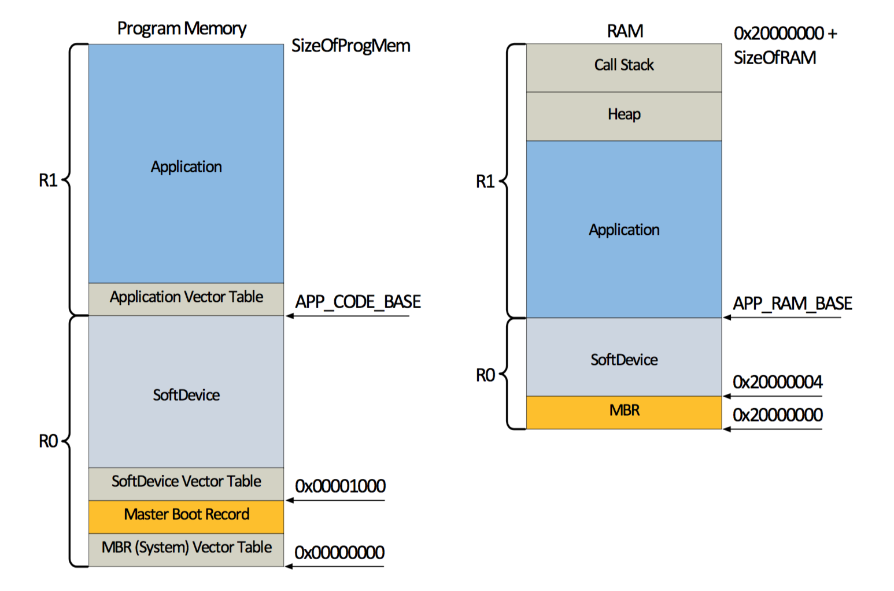
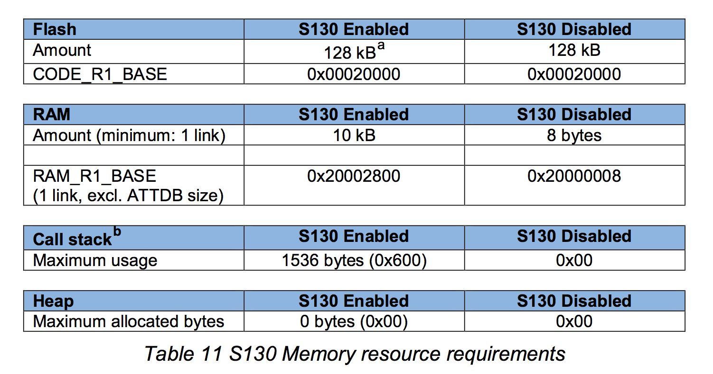
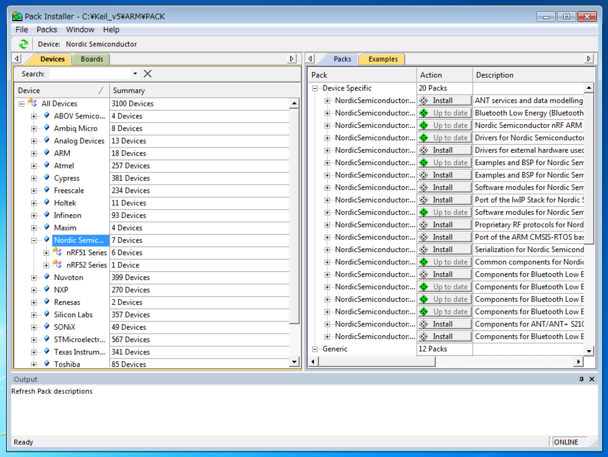
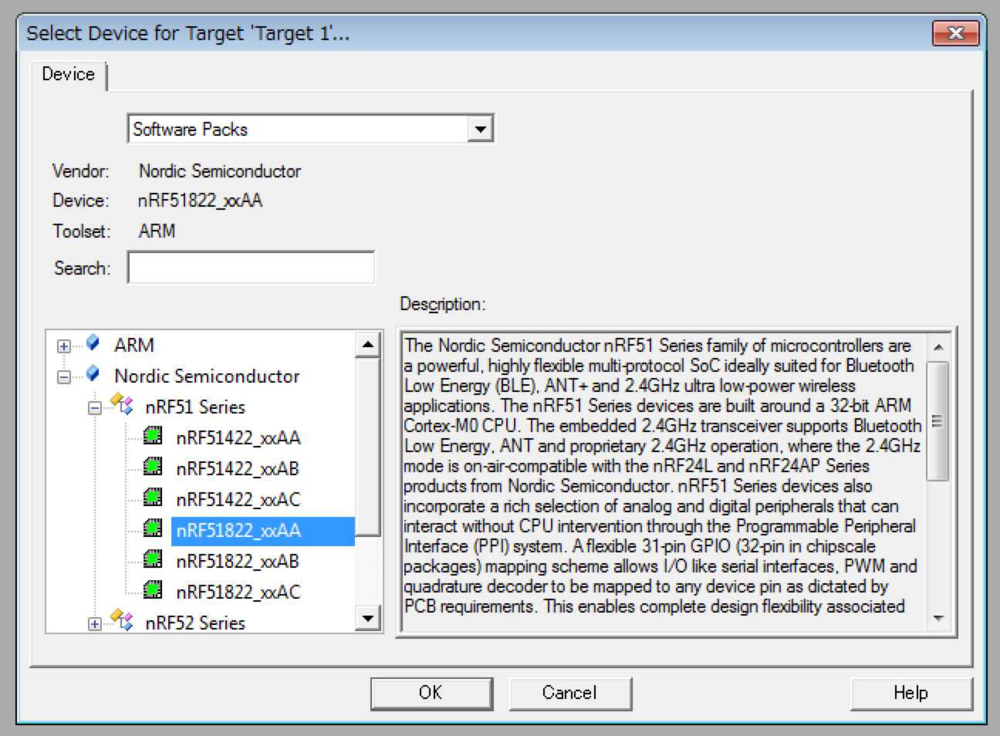
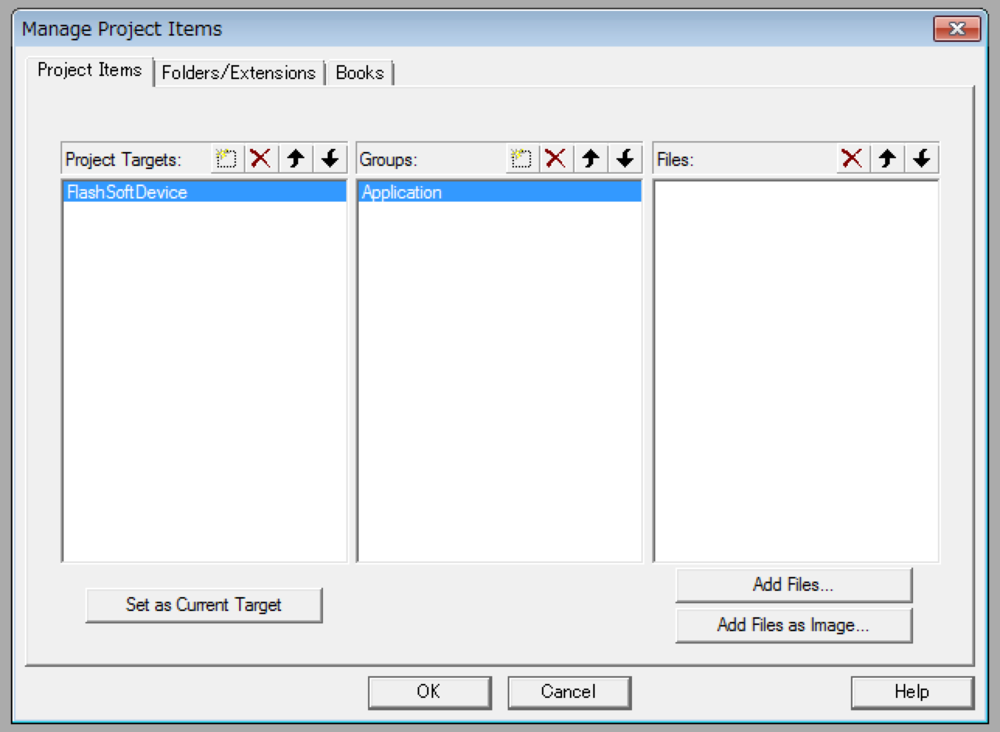
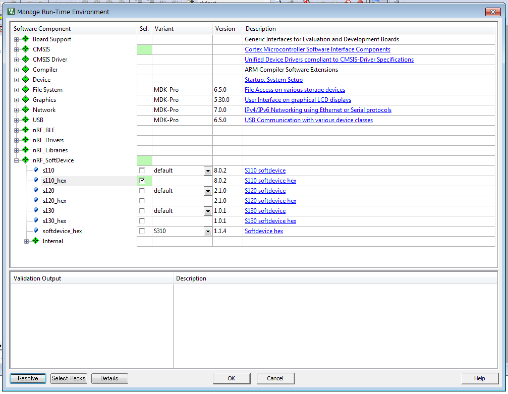
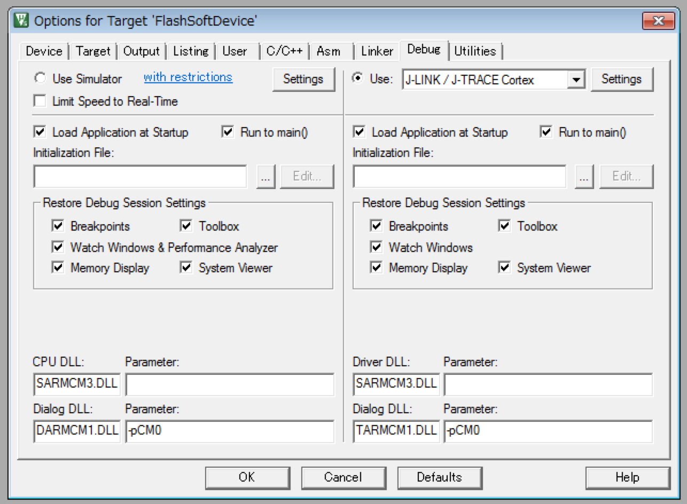

# SoftDevice

## SoftDeviceとは

Nordicが提供しているnRF5xシリーズ向けの[プロトコルスタック](https://ja.wikipedia.org/wiki/%E3%83%97%E3%83%AD%E3%83%88%E3%82%B3%E3%83%AB%E3%82%B9%E3%82%BF%E3%83%83%E3%82%AF)。  

### nRF51シリーズ  

BLE用はS110, S120, S130と３種類あり、それぞれ用途が異なる。  
ちなみにS210, S310は[ANT/ANT+](http://k-tai.impress.co.jp/docs/column/keyword/20110322_434325.html)用のスタックになる。  
ARM® CortexTM-M0向け。

### nRF52シリーズ

52シリーズ向けSoftDeviceは現在(2015/9)開発中で、S130をベースとしたS132のAlpha版が提供されている。  
S110,S120に対応した物も順次開発予定。  
ARM® Cortex-M4F向け。

### 対応チップとバージョン  

### 比較  

| SoftDevice | 概要 |
| -- | -- |
| S110 | Peripheral専用 |
| S120 | Central/Peripheral両用。  Centralモードの場合は8つ同時接続可能、Peripheralモードの場合は同時にBroadcasterとしても動作する。|
| S130 | Central/Peripheral同時利用。 Centralとして３接続と１つのPeripheralとして動作する。こちらはObserverとBroadcaster両方になれる。 |

### メモリマップ

## S110

## S120

## S130

# SoftDeviceを使ったプログラムの作成方法 

## 使用した環境
* MDK-Lite Ver. 5.16a
* Windows 7
* nRF51822 Development Dongle (PCA10000)
* [リファレンス](http://infocenter.nordicsemi.com/index.jsp?topic=%2Fcom.nordic.infocenter.sdk51.v9.0.0%2Findex.html&cp=4_1_0)

## 手順

### SoftDeviceを書き込むためのTarget作成

nRFgo StudioでもSoftDeviceの書き込みはできるが、Keil上に構築しておけばSoftDeviceとApplicationの書き込みの両方を同じツール上でできるので便利になる。

1. Keil uVision5を起動する
2. PackでSoftDeviceをインストールする  
 2.1. PackInstallerを起動する  
    
 2.2. 左ペインのDevicesからNordicを選択する  
 2.3. 右ペインのPacksからSoftDevice_S110をInstallする
    
 2.4. PackInstallerを閉じる

3. uVision5のProjectメニューから新たにプロジェクトを作成する
4. Deviceの設定を聞かれるのでSofware PacksのnRF51822_xxAAを選択する
    
5. Targetの作成  
 5.1. ManageProjectItemsを選択する  
    
 5.2. Target名とGropusを設定する  
      今回は「FlashSoftDevice」と「Application」とする
  
6. SoftDeviceの読み込み  
 6.1. Manage Run-Time Environmentを選択する  
    
 6.2. nRF_SoftDeviceからs110_hexを選択する  
      この時オレンジ色になり依存関係のエラーが表示されますが、左下のResolveボタンを押せば修正されます。  
    
 6.3. OKを押して閉じる
7. Targetの設定  
 7.1. Options for Targetを選択する  
    
 7.2. OutputタブのSelect Folder for Objects...を選択し、プロジェクトフォルダ下の"\RTE\nRF_SoftDevice\nRF51822_xxAA"を選択する  
 7.3. Name of Executableに"s110_softdevice.hex"とファイル名を入力する
    
 7.4. DebugタブのUseを"J-LINK / J-TRACE Cortex"に変更する  
  
 7.5. PortをSWに変更する
  
 7.6. Sizeを0x2000に(メモリマップのRAM_BASEの値)する  
      Addを選択して"nRF51xxx External ..."を追加する  
      古いAlgorithmはRemoveで削除する  
  
8. USBにPCA10000を差し込む
9. LOADボタンを押すとSoftDeviceの書き込みが開始されます  
 

### SoftDeviceを利用したApplication作成
