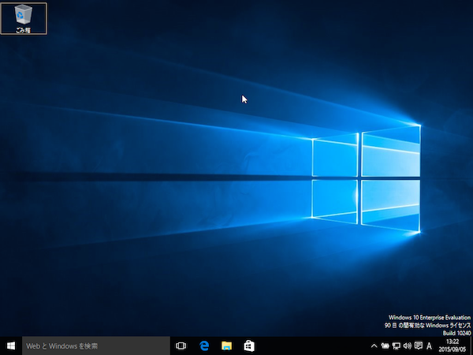

# Windows10で評価用の開発環境を構築する

| 項目 | ツール | ライセンス |
| -- | -- |
| VM | [VirtualBox](https://www.virtualbox.org/) | GPL Version2|
| OS | [Windows 10 Enterprise Evaluation(評価用)](https://technet.microsoft.com/ja-jp/evalcenter/dn781239.aspx) | 90日限定 |

## Windows10のISOイメージをダウンロード

[Windows 10 Enterprise Evaluation(評価用)](https://technet.microsoft.com/ja-jp/evalcenter/dn781239.aspx) より、Windows10のISOイメージをダウンロードしてきます(3.7G程度)。

## VirtualBoxのインストール

[VirtualBox](https://www.virtualbox.org/) からVirtualBoxをダウンロードし、インストールします。

